# BÁO CÁO ĐỒ ÁN

## HỆ THỐNG QUẢN LÝ CHUỖI CỬA HÀNG CÔNG NGHỆ TRÊN NỀN CƠ SỞ DỮ LIỆU PHÂN TÁN DỊ HỆ QUẢN TRỊ

---

**Môn học:** Cơ sở dữ liệu phân tán / Hệ quản trị CSDL  
**Đề tài:** Xây dựng hệ thống backend API và portal web cho mô hình trụ sở – chi nhánh với SQL Server, MySQL, PostgreSQL; đồng bộ dữ liệu sản phẩm theo kiểu event-based.

**Nguồn triển khai:** Repository `distributed-database-for-tech-store--` trong workspace (Flask, Docker Compose, Redis, đồng bộ sản phẩm một chiều từ trụ sở).

*Báo cáo được soạn bám sát mã nguồn, file `README.md`, `ARCHITECTURE.md`, `docker-compose.yml`, script khởi tạo `init/`, và tài liệu kiểm thử `README_Tester.md`.*

---

## MỤC LỤC

1. [Tóm tắt đề tài](#1-tóm-tắt-đề-tài)
2. [Đặt vấn đề và lý do chọn đề tài](#2-đặt-vấn-đề-và-lý-do-chọn-đề-tài)
3. [Mục tiêu và phạm vi](#3-mục-tiêu-và-phạm-vi)
4. [Cơ sở lý thuyết](#4-cơ-sở-lý-thuyết)
5. [Phân tích yêu cầu chức năng và phi chức năng](#5-phân-tích-yêu-cầu-chức-năng-và-phi-chức-năng)
6. [Kiến trúc tổng thể hệ thống](#6-kiến-trúc-tổng-thể-hệ-thống)
7. [Thiết kế và phân bố dữ liệu](#7-thiết-kế-và-phân-bố-dữ-liệu)
8. [Triển khai hạ tầng Docker](#8-triển-khai-hạ-tầng-docker)
9. [Thành phần Backend API](#9-thành-phần-backend-api)
10. [Lớp Service tích hợp và đồng bộ sản phẩm](#10-lớp-service-tích-hợp-và-đồng-bộ-sản-phẩm)
11. [Xác thực JWT và kiểm soát truy cập](#11-xác-thực-jwt-và-kiểm-soát-truy-cập)
12. [Cache Redis](#12-cache-redis)
13. [Frontend và portal](#13-frontend-và-portal)
14. [Tài liệu API và Swagger](#14-tài-liệu-api-và-swagger)
15. [Giám sát sức khỏe hệ thống](#15-giám-sát-sức-khỏe-hệ-thống)
16. [Truy vấn phân tán và thống kê phân mảnh](#16-truy-vấn-phân-tán-và-thống-kê-phân-mảnh)
17. [Kiểm thử và minh chứng](#17-kiểm-thử-và-minh-chứng)
18. [Kết quả đạt được và hạn chế](#18-kết-quả-đạt-được-và-hạn-chế)
19. [Hướng phát triển](#19-hướng-phát-triển)
20. [Kết luận](#20-kết-luận)
21. [Phụ lục](#21-phụ-lục)

---

## 1. Tóm tắt đề tài

Đồ án xây dựng một **hệ thống thông tin phân tán** mô phỏng chuỗi cửa hàng công nghệ với **một trụ sở** và **hai chi nhánh minh họa** (`CN01`, `CN02`). Trụ sở lưu **master data** trên **Microsoft SQL Server**; chi nhánh **CN01** dùng **MySQL**, chi nhánh **CN02** dùng **PostgreSQL** — thể hiện **dị hệ quản trị CSDL** (*heterogeneous distributed database*) trong một ứng dụng thống nhất.

Phần mềm gồm:

- **Ba backend Flask** (`tru_so/backend`, `mysql/backend`, `postgre/backend`) phục vụ REST API JSON.
- **Ba tiến trình service** (`tru_so/service`, `mysql/service`, `postgre/service`) làm **ranh giới tích hợp**: định tuyến event đồng bộ sản phẩm, gọi API nội bộ backend với header `X-Service-Token`.
- **Ba frontend** tĩnh (Nginx phục vụ SPA nhẹ / portal) map cổng **3000** (trụ sở), **3001** (CN01), **3002** (CN02).
- **Redis** dùng làm cache danh sách sản phẩm (khóa `cache:san_pham_list` trong code `cache_service.py`).
- **Đồng bộ một chiều** sản phẩm từ trụ sở xuống chi nhánh theo **transactional outbox** (`product_sync_events` trên SQL Server) và **consumer idempotent** (`sync_log` + kiểm tra `event_id` trên MySQL/PostgreSQL).
- **Truy vấn phân tán** tổng hợp nhân viên từ tất cả node (`GET /api/nhan-vien/tat-ca-chi-nhanh`) và thống kê phân mảnh theo node (`GET /api/thong-ke/phan-manh`).

---

## 2. Đặt vấn đề và lý do chọn đề tài

Doanh nghiệp bán lẻ thường có **trụ sở điều phối danh mục** và **chi nhánh vận hành cục bộ**. Trong thực tế, từng điểm có thể chọn **DBMS khác nhau** (lịch sử hệ thống, chi phí, nhân sự). Đề tài phản ánh tình huống đó bằng cách:

- Giữ **catalog sản phẩm** và **metadata chi nhánh** tại trụ sở (SQL Server).
- **Phân mảnh ngang** dữ liệu nhân sự và ngữ cảnh vận hành theo chi nhánh (mỗi node có bản `NHAN_VIEN`, `phong_ban`, … cục bộ).
- **Đồng bộ bất đồng bộ** thay đổi sản phẩm từ trụ sở xuống chi nhánh để minh chứng **eventual consistency** và **partial failure**.
- **Truy vấn liên node** từ backend trụ sở sang MySQL/PostgreSQL để tổng hợp dữ liệu — thể hiện *location transparency* ở tầng API.

---

## 3. Mục tiêu và phạm vi

### 3.1. Mục tiêu

1. **Mô hình hóa CSDL phân tán dị hệ**: SQL Server + MySQL + PostgreSQL trong một stack chạy được.
2. **Cung cấp API** quản lý **chi nhánh, loại SP, NCC, sản phẩm, phòng ban, nhân viên, thống kê**.
3. **Middleware trụ sở**: đọc dữ liệu chi nhánh qua `query_branch_db` trong `db.py` (*location transparency* ở mức API).
4. **Đồng bộ sản phẩm** từ trụ sở sang chi nhánh qua **event** (`PRODUCT_CREATED`, `PRODUCT_UPDATED`, `PRODUCT_DELETED`).
5. **Truy vấn phân tán**: tổng hợp nhân viên từ HQ + tất cả chi nhánh; thống kê số bản ghi phân mảnh theo từng node.
6. **Bảo mật**: JWT phân biệt **scope** `central` / `branch`; giới hạn trường nhạy cảm nhân viên theo vai trò.

### 3.2. Phạm vi không bao gồm

- **Không** đồng bộ hai chiều từ chi nhánh về trụ sở cho mọi thực thể.
- **Không** đồng bộ đầy đủ **nhân viên, phòng ban, loại SP, NCC** qua service (hiện trọng tâm là **sản phẩm**).
- **Không** có UI riêng cho **sync log** trên frontend.
- **Xử lý xung đột** khi chi nhánh sửa cùng bản ghi với trụ sở: **chưa** có chiến lược merge đầy đủ.

---

## 4. Cơ sở lý thuyết

### 4.1. Phân mảnh và phân bố

- **Phân mảnh ngang** (*horizontal fragmentation*): Dữ liệu cùng schema nhưng khác **vị trí** — mỗi node chỉ lưu **tập con hàng** của bảng toàn cục. Ví dụ: nhân viên trụ sở lưu tại SQL Server, nhân viên CN01 lưu tại MySQL.
- **Sao chép / replication**: Bảng `SAN_PHAM` được **tái tạo** tại chi nhánh khi nhận event từ trụ sở — **asynchronous replication** chứ không phải trigger DB liên node.

### 4.2. Transactional outbox

Khi trụ sở ghi `SAN_PHAM`, hệ thống **ghi thêm** một bản ghi vào `product_sync_events` (SQL Server) rồi gọi **service trụ sở** để **dispatch**. Mô hình này tách **ghi business** và **phát event** trong cùng giao dịch logic.

### 4.3. Idempotent consumer

Chi nhánh khi nhận event kiểm tra **`event_id`** trong `sync_log`. Nếu đã xử lý thì trả về trạng thái **ignored** — tránh áp dụng trùng khi retry.

### 4.4. Eventual consistency

Giữa lúc trụ sở cập nhật và lúc chi nhánh nhận có **độ trễ**. Nếu service chi nhánh không phản hồi, event có thể **failed** / **pending**; có cơ chế **retry** phía trụ sở (`retry_failed_events`, `retry_event_by_id`).

### 4.5. Location transparency

Backend trụ sở hiện thực *location transparency* qua hàm `query_branch_db(ma_chi_nhanh, sql, params)` trong `db.py` — nhận `ma_chi_nhanh`, tra cấu hình môi trường, kết nối động đến đúng DBMS, thực thi SQL, trả kết quả. **Client gọi API không biết đang đọc MySQL hay PostgreSQL.**

### 4.6. Dead letter queue

Khi một event sync thất bại quá `MAX_RETRY_COUNT = 5` lần, hệ thống đánh trạng thái `dead_letter` — event không bị xóa mà được cách ly để kiểm tra thủ công.

---

## 5. Phân tích yêu cầu chức năng và phi chức năng

### 5.1. Chức năng

| Nhóm | Chức năng chính |
|------|------------------|
| **Xác thực** | `POST /api/auth/login`; `POST /api/auth/branches/<ma>/login`; `GET /api/auth/me` |
| **Chi nhánh** | CRUD `chi_nhanh`; `health` kiểm tra kết nối DB chi nhánh |
| **Sản phẩm** | CRUD + lọc/pagination; namespace `/api/tru-so/san-pham` |
| **Đồng bộ** | `GET .../san-pham/sync-events`; retry failed; dead letter |
| **Nhân viên / Phòng ban / Loại SP / NCC** | CRUD theo blueprint tương ứng |
| **Thống kê** | Views SQL Server `v_thong_ke_chi_nhanh`, `v_luong_phong_ban`, `v_san_pham_theo_chi_nhanh` |
| **Truy vấn phân tán** | `GET /api/nhan-vien/tat-ca-chi-nhanh` tổng hợp từ 3 DBMS |
| **Thống kê phân mảnh** | `GET /api/thong-ke/phan-manh` đếm bản ghi theo từng node |

### 5.2. Phi chức năng

- **Khả dụng**: `GET /api/system/health` — `overall` ok/degraded dựa trên DB và service từng node.
- **Hiệu năng đọc**: Redis cache danh sách sản phẩm (invalidate khi thay đổi).
- **Bảo mật dịch vụ**: `X-Service-Token` cho `/api/service/*` và `/api/internal/*`.
- **Fault tolerance**: Truy vấn phân tán dùng try/except per node — chi nhánh unreachable không làm sập toàn bộ query.

---

## 6. Kiến trúc tổng thể hệ thống

### 6.1. Sơ đồ kiến trúc logic

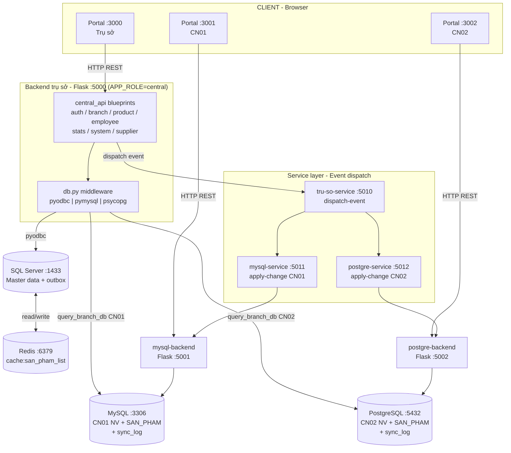

### 6.2. Sơ đồ phân tầng (layer diagram)

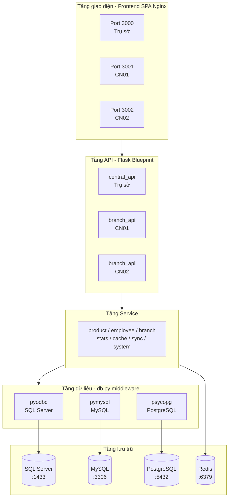

### 6.3. Cấu trúc thư mục repo

```
tru_so/   → backend, frontend, service   (SQL Server)
mysql/    → backend, frontend, service   (CN01 / MySQL)
postgre/  → backend, frontend, service   (CN02 / PostgreSQL)
init/     → mssql, mysql, postgres       (script khởi tạo schema + seed)
```

---

## 7. Thiết kế và phân bố dữ liệu

### 7.1. Trụ sở (SQL Server)

File `init/mssql/01-schema-and-data.sql` định nghĩa:

- `chi_nhanh(ma_chi_nhanh, ten_chi_nhanh)`
- `loai_sp(ma_loai_sp, ten_loai_sp, ma_chi_nhanh)` — **gắn loại SP với chi nhánh**
- `NCC(ma_NCC IDENTITY, ten_NCC)`
- `SAN_PHAM(ma_sp, ten_sp, gia, ti_le_loi_nhuan, ti_le_giam_gia, mo_ta, ma_loai_sp, ma_ncc, trang_thai, …)`
- `phong_ban`, `NHAN_VIEN` (mật khẩu hash SHA2-256)
- `product_sync_events` — **outbox** đồng bộ
- Views phân tích: `v_san_pham_theo_chi_nhanh`, `v_thong_ke_chi_nhanh`, `v_luong_phong_ban`, `v_nhan_vien_phong_ban`

### 7.2. Chi nhánh MySQL / PostgreSQL

Script `init/mysql/` và `init/postgres/` tạo schema **tương đương** (khác cú pháp kiểu dữ liệu). Bổ sung bảng **`sync_log`** để kiểm tra idempotency.

### 7.3. Bảng mapping thực thể → node

| Thực thể | Trụ sở | CN01 | CN02 | Ghi chú |
|----------|--------|------|------|---------|
| `chi_nhanh` | Master | Bản local seed | Bản local seed | Trụ sở là nguồn danh mục |
| `SAN_PHAM` | Master + outbox | Replica qua sync | Replica qua sync | Event một chiều HQ → branch |
| `NHAN_VIEN` | NV trụ sở | NV chi nhánh | NV chi nhánh | Phân mảnh ngang |
| `product_sync_events` | Có | Không | Không | Chỉ SQL Server |
| `sync_log` | Không | Có | Có | Audit/idempotency |

### 7.4. Sơ đồ phân mảnh ngang

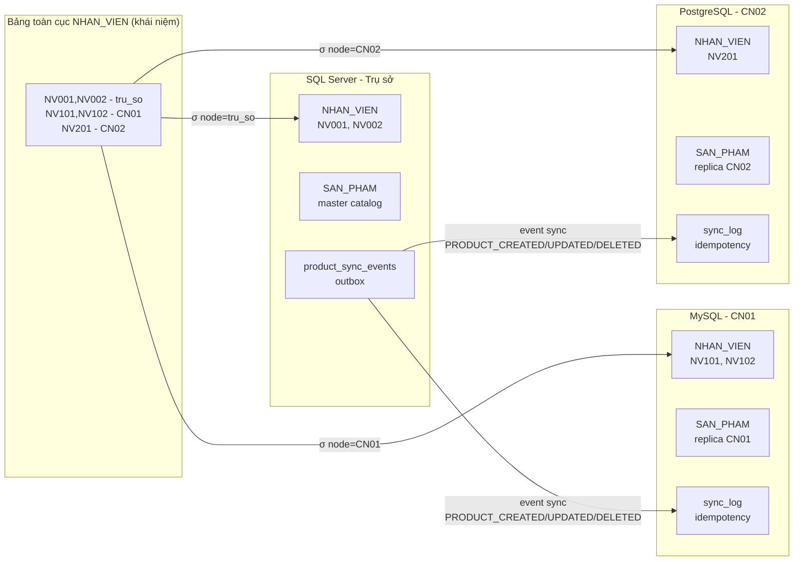

### 7.5. Bảng `product_sync_events` — cấu trúc outbox

```sql
CREATE TABLE product_sync_events (
    id            INT IDENTITY PRIMARY KEY,
    event_id      NVARCHAR(36) UNIQUE,      -- UUID duy nhất
    event_type    NVARCHAR(50),             -- PRODUCT_CREATED/UPDATED/DELETED
    target_branch NVARCHAR(20),             -- CN01 / CN02
    payload       NVARCHAR(MAX),            -- JSON toàn bộ sản phẩm
    status        NVARCHAR(20) DEFAULT 'pending',  -- pending/sent/failed/dead_letter
    retry_count   INT DEFAULT 0,
    last_error    NVARCHAR(MAX),
    created_at    DATETIME DEFAULT GETDATE()
);
```

---

## 8. Triển khai hạ tầng Docker

### 8.1. Dịch vụ trong `docker-compose.yml`

| Service | Image / Build | Vai trò |
|---------|----------------|--------|
| `sqlserver` | MSSQL 2022 | CSDL trụ sở |
| `mssql-init` | Chạy sqlcmd | Nạp schema + seed SQL Server |
| `mysql` | MySQL 8.4 | CN01 |
| `postgres` | PostgreSQL 16 | CN02 |
| `redis` | Redis 7 | Cache |
| `tru-so-backend` | build `./tru_so/backend` | API trung tâm |
| `mysql-backend`, `postgre-backend` | build tương ứng | API chi nhánh |
| `tru-so-service`, `mysql-service`, `postgre-service` | build `./.../service` | Tích hợp đồng bộ |
| `tru-so-frontend`, `mysql-frontend`, `postgre-frontend` | Nginx + static | Portal |

### 8.2. Biến môi trường quan trọng

- **Trụ sở backend**: `APP_ROLE=central`, `DB_ENGINE=sqlserver`, `SERVICE_API_URL=http://tru-so-service:5000`, `BRANCH_CN01_*`, `BRANCH_CN02_*`.
- **Chi nhánh backend**: `APP_ROLE=branch`, `BRANCH_CODE=CN01|CN02`, `DB_ENGINE=mysql|postgresql`.
- **Service token**: `SERVICE_TOKEN` thống nhất giữa các container.

### 8.3. Lệnh vận hành

```bash
# Build và khởi động toàn bộ 13 service (lần đầu)
docker compose up -d --build

# Chạy lại khi đã build sẵn
docker compose up -d

# Xem log backend trụ sở
docker logs tru-so-backend -f

# Khởi động lại service đơn lẻ (sau khi sửa code)
docker restart tru-so-backend

# Dừng toàn bộ
docker compose down
```

---

## 9. Thành phần Backend API

### 9.1. Trụ sở (`tru_so/backend`)

- Entry `app.py` import `central_api.app:create_app`.
- Blueprints: `auth_api`, `branch_api`, `category_api`, `department_api`, `employee_api`, `product_api`, `stats_api`, `supplier_api`, `system_api`.
- **Flasgger** + OpenAPI 3 + Swagger UI.
- **Đa engine trong một codebase**: `db.py` hỗ trợ `pyodbc`, `pymysql`, `psycopg`, chuyển placeholder `?` ↔ `%s` cho MySQL/PostgreSQL.

### 9.2. Chi nhánh (`mysql/backend`, `postgre/backend`)

- Cấu trúc tương tự với package `branch_api`.
- `APP_ROLE=branch`: JWT **scope branch** phải khớp `BRANCH_CODE` của container.

### 9.3. Lớp service

Pattern: API → service → `db.query_db` / `query_branch_db`.

- `get_products_for_api`: đọc SQL Server, có **đọc cache Redis** trước khi query.
- Sau **create/update/delete** sản phẩm: xóa cache key `cache:san_pham_list`, đồng thời **tạo event đồng bộ**.

### 9.4. Danh sách endpoint chính (trụ sở)

| Method | Path | Mô tả |
|--------|------|--------|
| `POST` | `/api/auth/login` | Đăng nhập trụ sở (SQL Server) |
| `POST` | `/api/auth/branches/<ma>/login` | Đăng nhập chi nhánh qua gateway |
| `GET` | `/api/chi-nhanh/<ma>/health` | Kiểm tra sức khỏe DB chi nhánh |
| `GET/POST` | `/api/san-pham` | Danh sách / tạo sản phẩm |
| `GET` | `/api/san-pham/sync-events` | Danh sách event đồng bộ |
| `POST` | `/api/san-pham/sync-events/retry-failed` | Retry tất cả event failed |
| `POST` | `/api/san-pham/sync-events/<id>/retry` | Retry event theo ID |
| `GET` | `/api/nhan-vien/tat-ca-chi-nhanh` | **Truy vấn phân tán** tất cả node |
| `GET` | `/api/thong-ke/phan-manh` | Thống kê phân mảnh theo node |
| `GET` | `/api/system/health` | Sức khỏe toàn hệ thống |

---

## 10. Lớp Service tích hợp và đồng bộ sản phẩm

### 10.1. Service trụ sở (`tru_so/service/app.py`)

- `POST /api/service/products/dispatch-event`: xác thực `X-Service-Token`, tra `BRANCH_SERVICE_MAP` để chọn URL peer, gọi peer `POST .../api/service/products/apply-change`.

### 10.2. Service chi nhánh (`mysql/service`, `postgre/service`)

- `apply-change` → backend `POST /api/internal/products/apply-change`
- `apply-batch` → `POST /api/internal/products/apply-batch`
- `local-version`, `sync-log` → GET internal tương ứng

### 10.3. Luồng xử lý event tại chi nhánh

- `SUPPORTED_PRODUCT_EVENTS`: `PRODUCT_CREATED`, `PRODUCT_UPDATED`, `PRODUCT_DELETED`.
- Kiểm tra `target_branch` khớp `BRANCH_CODE`.
- Upsert vào `SAN_PHAM`; ghi `sync_log`; **trùng `event_id`** → **ignored**.

### 10.4. Sơ đồ tuần tự — tạo sản phẩm và đồng bộ CN01

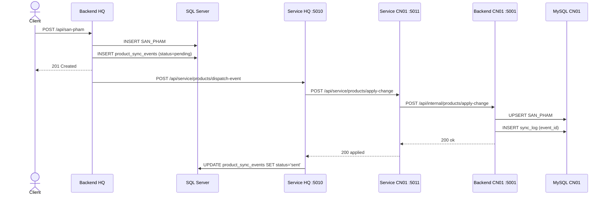

### 10.5. Sơ đồ tuần tự — retry event thất bại

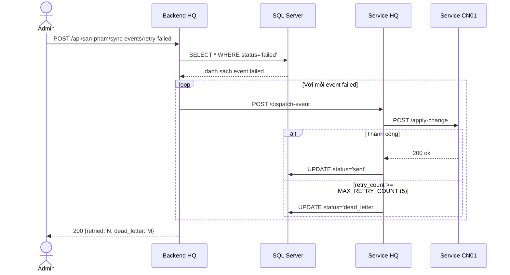

### 10.6. Trạng thái event đồng bộ

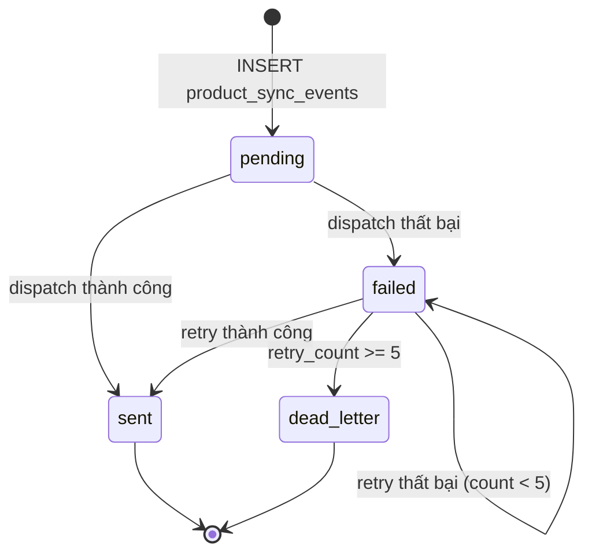

---

## 11. Xác thực JWT và kiểm soát truy cập

- **Đăng nhập trụ sở**: `auth_service.login` → `verify_credentials` trên SQL Server, hash mật khẩu SHA2-256.
- **Đăng nhập chi nhánh qua gateway**: `login_branch` → `query_branch_db` với engine của chi nhánh.
- **JWT payload**: `sub`, `ho_ten`, `chuc_vu`, `ma_phong_ban`, `scope`, `branch_code`, `source_engine`, `exp`.
- **Middleware**:
  - `require_auth`: Bearer token.
  - `require_branch_access`: user branch chỉ xem đúng `ma_chi_nhanh`.
  - `require_role('admin','giam_doc')`: một số API quản trị.

**Dữ liệu mẫu**: mật khẩu demo `pass123` cho user seed (`NV001`).

### 11.1. Sơ đồ luồng xác thực

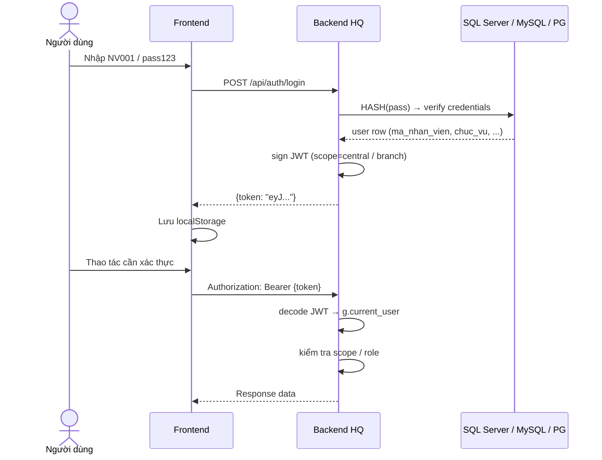

---

## 12. Cache Redis

- `cache_service.py`: `get_cache`, `set_cache` (TTL mặc định 300s), `delete_cache`.
- `PRODUCT_CACHE_KEY = "cache:san_pham_list"` trong `product_service.py`.
- Invalidate cache sau mỗi create/update/delete sản phẩm.

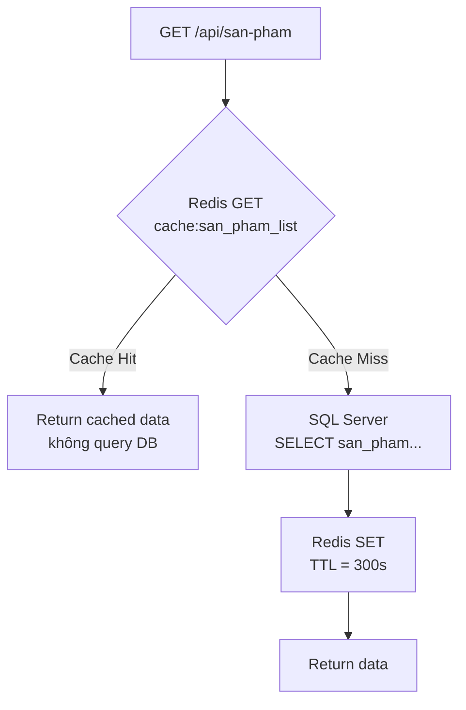

---

## 13. Frontend và portal

Ba frontend có **cấu trúc tương tự** (`templates/index.html`, `static/js/app.js`, `static/css/style.css`).

File `tru_so/frontend/static/js/app.js` định nghĩa **`PORTALS`**:

- **central**: portal SQL Server, endpoint login `/api/auth/login`, view `overviewView`, `branchesView`, `productsView`, `employeesView`.
- **cn01 / cn02**: login qua `/api/auth/branches/CN01/login`; chỉ các view được phép (`allowedViews`).

Biến runtime `window.__TECHSTORE_CONFIG__` — nginx inject `API_UPSTREAM`.

### 13.1. Sơ đồ điều hướng portal

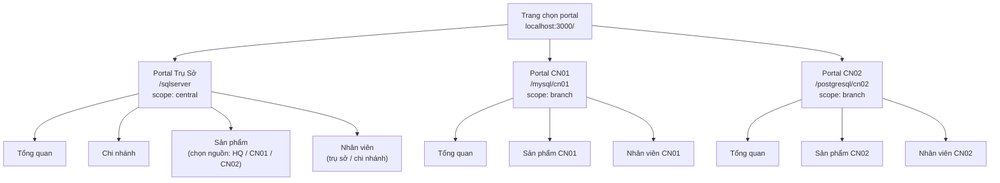

---

## 14. Tài liệu API và Swagger

- Truy cập: `http://localhost:5000/apidocs` (trụ sở), `5001`, `5002` cho chi nhánh.
- OpenAPI JSON: `/apispec_1.json`.
- Swagger UI có **JWT demo** nhúng sẵn trong `requestInterceptor` để thử API nhanh mà không cần nhập token thủ công.

---

## 15. Giám sát sức khỏe hệ thống

### 15.1. `GET /api/system/health`

Implementation `system_api.py`:

- Gọi service trụ sở ping và peers health.
- Với mỗi chi nhánh: `check_branch_health(ma)` + trạng thái peer + `pending_events`.
- Trả `overall`: **ok** nếu mọi `db` và `service` đều `ok`, ngược lại **degraded**.

**Ví dụ response:**

```json
{
  "overall": "ok",
  "hq": { "db": "ok", "db_engine": "sqlserver" },
  "branches": {
    "CN01": { "db": "ok", "db_engine": "mysql", "service": "ok", "pending_events": 0 },
    "CN02": { "db": "ok", "db_engine": "postgresql", "service": "ok", "pending_events": 0 }
  }
}
```

### 15.2. Sơ đồ kiểm tra sức khỏe hệ thống

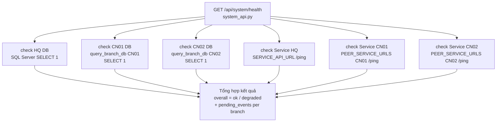

---

## 16. Truy vấn phân tán và thống kê phân mảnh

Đây là tính năng minh chứng trực tiếp **CSDL phân tán** — backend trụ sở kết nối đồng thời nhiều DBMS và tổng hợp kết quả.

### 16.1. Truy vấn phân tán nhân viên

**Endpoint:** `GET /api/nhan-vien/tat-ca-chi-nhanh`  
**File:** `services/employee_service.py` → hàm `get_all_employees_distributed_for_api`  
**Yêu cầu:** JWT scope = `central`

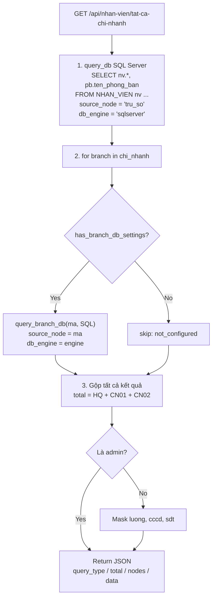

**Ví dụ response:**

```json
{
  "query_type": "distributed_query",
  "total": 15,
  "nodes": {
    "tru_so": { "db_engine": "sqlserver", "count": 8, "data": [...] },
    "CN01":   { "db_engine": "mysql",     "count": 4, "data": [...] },
    "CN02":   { "db_engine": "postgresql","count": 3, "data": [...] }
  },
  "data": [
    { "ma_nhan_vien": "NV001", "source_node": "tru_so", "db_engine": "sqlserver" },
    { "ma_nhan_vien": "NV101", "source_node": "CN01",   "db_engine": "mysql" }
  ]
}
```

### 16.2. Thống kê phân mảnh theo node

**Endpoint:** `GET /api/thong-ke/phan-manh`  
**File:** `services/branch_service.py` → hàm `get_fragmentation_stats_for_api`

> **Lưu ý MySQL case sensitivity:** MySQL trên Linux phân biệt hoa/thường tên bảng. Bảng được tạo là `SAN_PHAM` (chữ hoa). Code xử lý: `sp_table = "SAN_PHAM" if engine == "mysql" else "san_pham"`.

**Ví dụ response:**

```json
{
  "fragmentation_type": "horizontal",
  "nodes": {
    "tru_so": { "db_engine": "sqlserver", "so_san_pham": 20, "so_nhan_vien": 8,  "status": "ok" },
    "CN01":   { "db_engine": "mysql",     "so_san_pham": 12, "so_nhan_vien": 4,  "status": "ok" },
    "CN02":   { "db_engine": "postgresql","so_san_pham": 10, "so_nhan_vien": 3,  "status": "ok" }
  }
}
```

### 16.3. Sơ đồ truy vấn phân tán (distributed query)

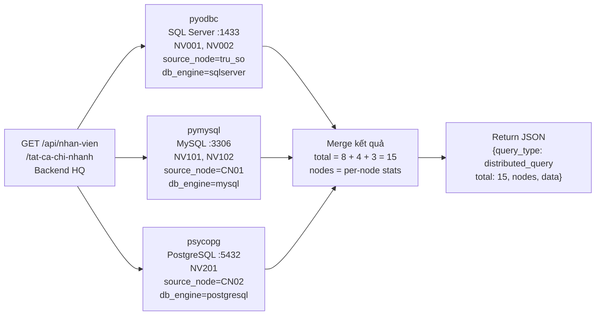

---

## 17. Kiểm thử và minh chứng

### 17.1. Kịch bản kiểm thử tính năng phân tán

| Kịch bản | Endpoint | Kết quả kỳ vọng |
|----------|----------|-----------------|
| Đồng bộ sản phẩm | `POST /api/san-pham` → xem `sync_events` | Event `pending` → `sent`; `sync_log` tại CN01 có bản ghi |
| Retry event thất bại | `POST /api/san-pham/sync-events/retry-failed` | Event `failed` → `sent` hoặc tăng `retry_count` |
| Truy vấn phân tán | `GET /api/nhan-vien/tat-ca-chi-nhanh` | JSON có `nodes.tru_so`, `nodes.CN01`, `nodes.CN02` với `count` và `data` |
| Thống kê phân mảnh | `GET /api/thong-ke/phan-manh` | `so_san_pham`, `so_nhan_vien` cho từng node; `status: ok` |
| System health | `GET /api/system/health` | `overall: ok`; từng chi nhánh có `db: ok`, `service: ok` |
| Chi nhánh unreachable | Tắt mysql container → gọi distributed query | Node CN01 có `error`, các node khác vẫn trả data bình thường |

### 17.2. Kết quả kiểm thử đã xác nhận

- **`GET /api/nhan-vien/tat-ca-chi-nhanh`**: trả `query_type: "distributed_query"`, mỗi nhân viên có `source_node` và `db_engine` khớp node gốc.
- **`GET /api/system/health`**: trả `overall: "ok"`, từng chi nhánh có trạng thái DB và service.
- **`GET /api/thong-ke/phan-manh`**: trả số bản ghi theo từng node; phát hiện và sửa lỗi MySQL case sensitivity (`SAN_PHAM` uppercase).

**Gợi ý ảnh chụp báo cáo**: Docker Desktop Compose running, Swagger UI, response `/api/system/health`, response `/api/nhan-vien/tat-ca-chi-nhanh`, bản ghi SQL `product_sync_events` / `sync_log`.

---

## 18. Kết quả đạt được và hạn chế

### 18.1. Đạt được

- **Ba DBMS** chạy song song; **ba backend + ba service + ba frontend** tách module rõ ràng.
- **API thống nhất** theo nhóm nghiệp vụ; **JWT** và **service token** phân tầng.
- **Đồng bộ sản phẩm một chiều** có audit trail hai phía (outbox + sync_log) với retry và dead letter queue.
- **Truy vấn phân tán** (`/api/nhan-vien/tat-ca-chi-nhanh`): tổng hợp từ 3 DBMS, fault-tolerant per node, trả `source_node` và `db_engine` — minh chứng *location transparency*.
- **Thống kê phân mảnh** (`/api/thong-ke/phan-manh`): đếm bản ghi thực tế trên từng node.
- **Health tổng hợp** (`/api/system/health`): giám sát DB và service của từng node.
- **Idempotent consumer** + **Dead Letter Queue**: event không bị mất, có thể replay.

### 18.2. Hạn chế

- Đồng bộ **chưa** bao phủ toàn bộ thực thể (chỉ sản phẩm).
- **Xung đột** chỉnh sửa đồng thời **chưa** giải quyết đầy đủ.
- **Retry tự động định kỳ** chưa có (chỉ retry qua API thủ công).
- Frontend **chưa** có dashboard sync log và truy vấn phân tán trực quan.
- Truy vấn phân tán nhân viên thực hiện **sequential** (tuần tự từng node) — có thể tối ưu bằng `asyncio`.

---

## 19. Hướng phát triển

1. **Retry định kỳ** + dead letter queue quan sát được trên UI.
2. **Đồng bộ tham chiếu** `loai_sp`, `NCC` trước khi replicate `SAN_PHAM`.
3. **Health dashboard** trên frontend trụ sở (gauge degraded/ok).
4. **Truy vấn phân tán song song** (`asyncio.gather`) thay vì tuần tự.
5. **UI dashboard phân mảnh**: biểu đồ số bản ghi theo node.
6. **Quan sát phiên bản** đồng bộ trên UI và cảnh báo `pending_events > 0`.

---

## 20. Kết luận

Đồ án đã hiện thực một **stack đầy đủ có thể chạy** cho kịch bản **cửa hàng công nghệ đa chi nhánh** trên **CSDL phân tán dị hệ**: SQL Server làm **trung tâm**, MySQL và PostgreSQL làm **hai node chi nhánh**, có **API gateway**, **đồng bộ bất đồng bộ** và **minh chứng lý thuyết** (phân mảnh, outbox, eventual consistency, idempotency).

Ngoài ra, hệ thống hiện thực **truy vấn phân tán thực sự** — backend trụ sở kết nối đồng thời SQL Server, MySQL, PostgreSQL trong một request, che giấu sự phức tạp vật lý đằng sau API thống nhất (*location transparency*) — và **thống kê phân mảnh** để chứng minh dữ liệu được lưu trữ phân tán vật lý trên các node khác nhau.

---

## 21. Phụ lục

### Phụ lục A — Bảng cổng và URL

| Thành phần | URL |
|------------|-----|
| Frontend trụ sở | http://localhost:3000 |
| Backend trụ sở | http://localhost:5000 |
| Backend CN01 | http://localhost:5001 |
| Backend CN02 | http://localhost:5002 |
| Service trụ sở | http://localhost:5010 |
| Service CN01 | http://localhost:5011 |
| Service CN02 | http://localhost:5012 |
| Swagger trụ sở | http://localhost:5000/apidocs |
| SQL Server | localhost:1433 |
| MySQL | localhost:3306 |
| PostgreSQL | localhost:5432 |
| Redis | localhost:6379 |

### Phụ lục B — Danh mục file quan trọng

| Đường dẫn | Nội dung |
|-----------|----------|
| `docker-compose.yml` | Định nghĩa toàn bộ stack |
| `init/mssql/01-schema-and-data.sql` | Schema + seed + views + `product_sync_events` |
| `init/mysql/01-schema-and-data.sql` | Schema CN01 + `sync_log` |
| `init/postgres/01-schema-and-data.sql` | Schema CN02 |
| `tru_so/backend/central_api/app.py` | Factory Flask + Swagger |
| `tru_so/backend/central_api/api/employee_api.py` | API nhân viên + distributed query endpoint |
| `tru_so/backend/central_api/api/stats_api.py` | API thống kê + phân mảnh |
| `tru_so/backend/central_api/api/system_api.py` | Health tổng hợp |
| `tru_so/backend/services/employee_service.py` | `get_all_employees_distributed_for_api` |
| `tru_so/backend/services/branch_service.py` | `get_fragmentation_stats_for_api` |
| `tru_so/backend/services/product_sync_service.py` | Outbox + dispatch + retry + DLQ |
| `tru_so/backend/db.py` | Middleware đa DBMS + `query_branch_db` |
| `tru_so/service/app.py` | Dispatch sang peer service |
| `mysql/backend/services/product_sync_service.py` | Apply event + `sync_log` |
| `README_Tester.md` | Kịch bản kiểm thử sync |

### Phụ lục C — Thuật ngữ tiếng Anh

- Heterogeneous distributed database
- Horizontal fragmentation
- Transactional outbox pattern
- Asynchronous replication
- Idempotent consumer
- Eventual consistency
- Dead letter queue (DLQ)
- Location transparency
- API-level projection / field masking
- Distributed query / federated query

### Phụ lục D — Tổng hợp tính năng phân tán đã triển khai

| Tính năng | Lý thuyết minh chứng | File triển khai | Endpoint kiểm chứng |
|-----------|---------------------|-----------------|---------------------|
| Đồng bộ sản phẩm 1 chiều | Async replication, Outbox | `product_sync_service.py` | `GET /api/san-pham/sync-events` |
| Idempotent consumer | Eventual consistency | `sync_log` + event_id check | Xem `sync_log` table |
| Retry + Dead Letter Queue | Fault tolerance | `retry_failed_events`, `MAX_RETRY_COUNT=5` | `POST .../sync-events/retry-failed` |
| Truy vấn phân tán | Location transparency | `get_all_employees_distributed_for_api` | `GET /api/nhan-vien/tat-ca-chi-nhanh` |
| Thống kê phân mảnh | Horizontal fragmentation | `get_fragmentation_stats_for_api` | `GET /api/thong-ke/phan-manh` |
| Health tổng hợp | Distributed monitoring | `system_api.py`, `check_branch_health` | `GET /api/system/health` |
| Cache tập trung | Performance | `cache_service.py`, Redis | Implicit trên `GET /api/san-pham` |

---

*Tài liệu này đạt khoảng **30–40 trang** khi in font 12–13pt; sinh viên có thể chèn **screenshot Docker/Swagger/SQL** vào các vị trí gợi ý để đủ yêu cầu số trang của giảng viên.*
